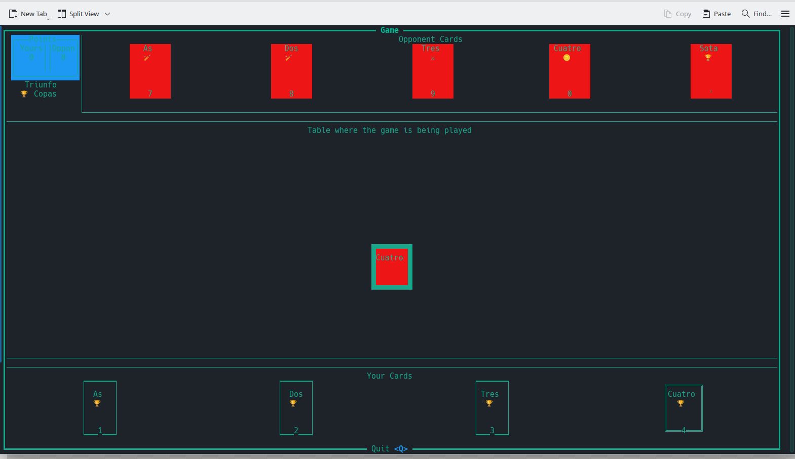
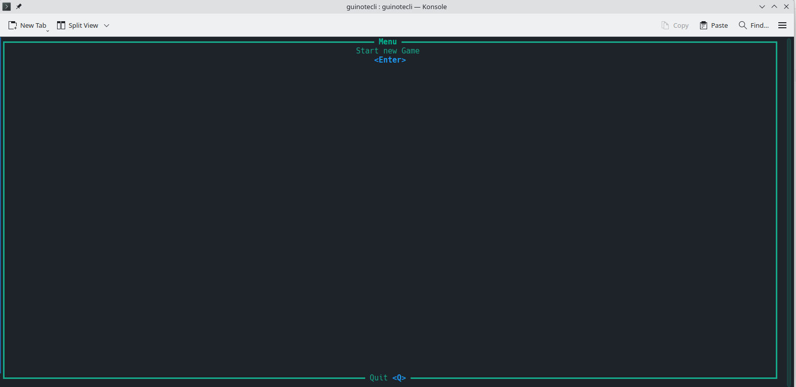
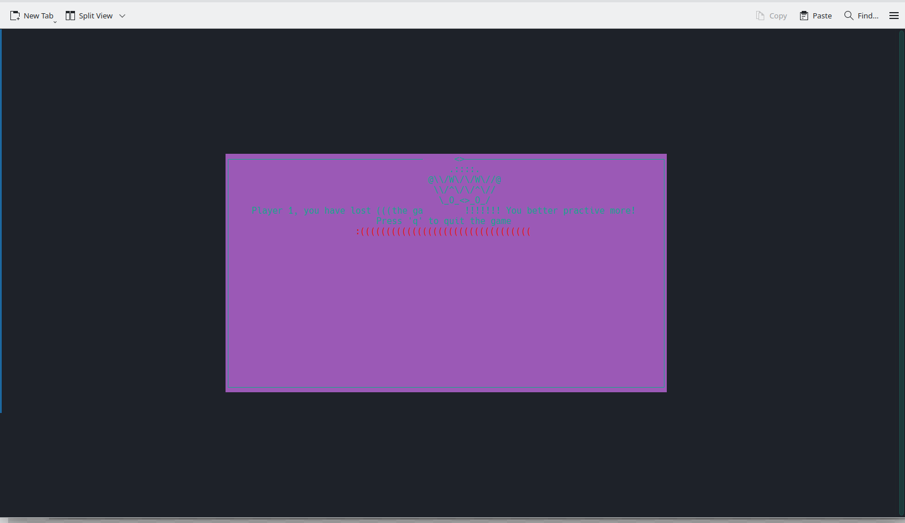

# Guinote CLI

An open source terminal (ugly implementation) of the Spanish card game Guiñote.

You can try it out by compiling the code yourself or downloading the latest (linux) release from the [releases](https://github.com/v1ctorio/guinotecli/releases)

The current prerelease is only the rendering engine and a little bit of logic. You can select and play cards, render points and all the cards in the spanish deck.

